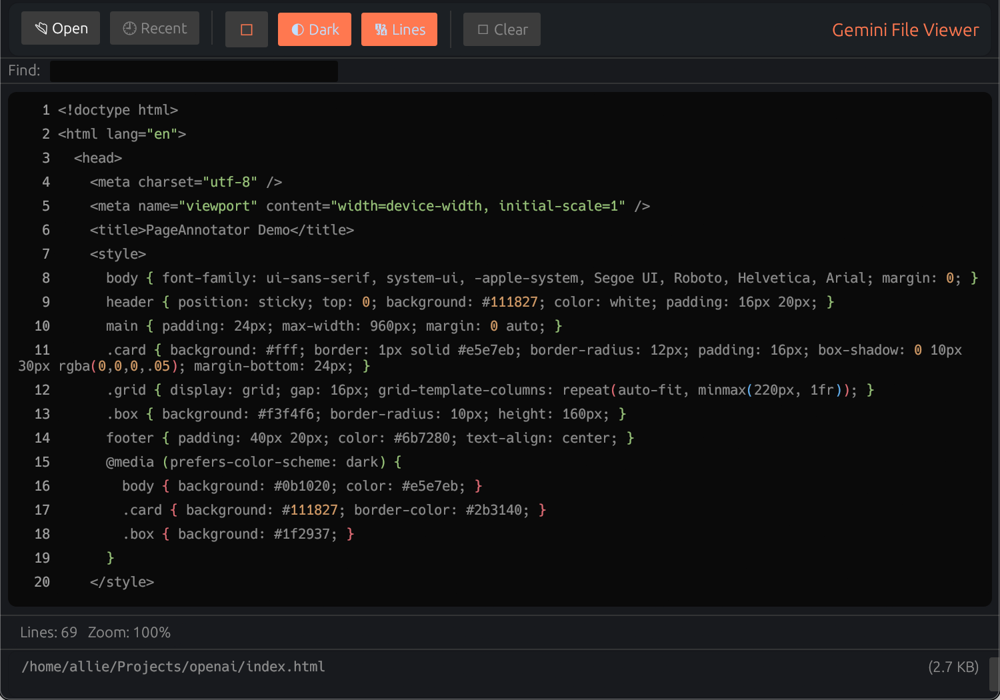

Gemini File Viewer (Linux)

A lightweight desktop viewer for text/code and images, built with egui/eframe. This variant is set up for Linux builds with small, portable binaries.

Highlights
- Modern UI: Top toolbar, search bar, and dual status bars.
- Theming: Dark/Light toggle and accent color picker.
- Text tools: Line numbers, word wrap, find with match count and navigation.
- Image tools: Folder Prev/Next, Fit-to-viewport, zoom -, +, 100%, wheel zoom.
- Drag & drop: Drop a file anywhere to open it.
- Persistent settings: Remembers Dark Mode, Line Numbers, and Recent Files across runs.
- Recent Files: Wide, non-wrapping menu with a Clear option.
- Image formats: PNG, JPEG, GIF, BMP, WEBP (scaled smoothly).
- Size-optimized release: opt-level="z", LTO, panic=abort, strip=true.

New UI Details
- Toolbar: Quick access to Open, Recent files, Dark/Light, Line Numbers, Accent color, and Clear.
- Search Bar: Appears for text; supports Enter/Shift+Enter and Prev/Next with match counts.
- Status Bars: Path + size with Copy Path and Open Folder, plus contextual info (image dimensions/zoom or text lines/zoom).
- Keyboard: See shortcuts below; mouse wheel with Ctrl zooms text/images.

Screenshots
- Toolbar and theming:
  
- Text search:
  
- Image viewer:
  
- Quick demo:
  
 - Additional screen:
   

Prerequisites
- Toolchain: Rust stable (rustup)
- System libraries (Ubuntu/Debian):
  sudo apt update && sudo apt install -y \
    build-essential pkg-config \
    libx11-dev libxrandr-dev libxi-dev libxcursor-dev \
    libgl1-mesa-dev libegl1-mesa-dev \
    libxkbcommon-dev libwayland-dev \
    xdg-desktop-portal xdg-desktop-portal-gtk

Notes on dialogs and Wayland
- rfd uses desktop portals on modern Linux. Ensure xdg-desktop-portal and a backend (gtk/gnome/kde) are running.
- If you hit Wayland issues, force X11: WINIT_UNIX_BACKEND=x11 ./gemini-file-viewer-linux

Build
- Release (optimized):
  cargo build --release
  ./target/release/gemini-file-viewer-linux

- Debug (faster compile):
  cargo build
  ./target/debug/gemini-file-viewer-linux

Portable-ish (musl)
- Install musl target and tools:
  rustup target add x86_64-unknown-linux-musl
  sudo apt install -y musl-tools
- Build:
  cargo build --release --target x86_64-unknown-linux-musl
- Note: You still need GPU/GL drivers at runtime; GL can’t be fully static.

Packaging
- Simple tarball:
  tar -C target/release -czf gemini-file-viewer-linux-x86_64.tar.gz gemini-file-viewer-linux
- Optional desktop integration: ship a .desktop file and icon under ~/.local/share/applications and ~/.local/share/icons.

Custom Fonts (optional, recommended)
- Drop TTFs into `assets/fonts/` to enable premium typography:
  - Inter: `Inter-Regular.ttf`, `Inter-Medium.ttf`, `Inter-SemiBold.ttf`
  - JetBrains Mono: `JetBrainsMono-Regular.ttf`, `JetBrainsMono-Bold.ttf`
- On startup the app auto-detects and applies these. If missing, it falls back to system defaults.
- Suggested sources: https://rsms.me/inter/ and https://www.jetbrains.com/lp/mono/

Scripts
- scripts/install-deps-ubuntu.sh: Installs common build deps on Ubuntu/Debian.
- scripts/build-release.sh: Builds size-optimized release.
- scripts/build-musl.sh: Builds a musl release (adds target if missing).
 - scripts/CAPTURE.md: How to capture screenshots/GIF and where to place them.

Shortcuts
- Ctrl+O: Open file dialog
- Ctrl+D: Toggle dark mode
- Ctrl+L: Toggle line numbers
- Ctrl+W: Toggle word wrap
- Ctrl+F: Find in text
- Ctrl+Wheel: Zoom content (text/image)
- Ctrl+= / Ctrl+-: Zoom in/out
- Ctrl+0: Reset zoom
- < / >: Image prev/next (when viewing an image)
